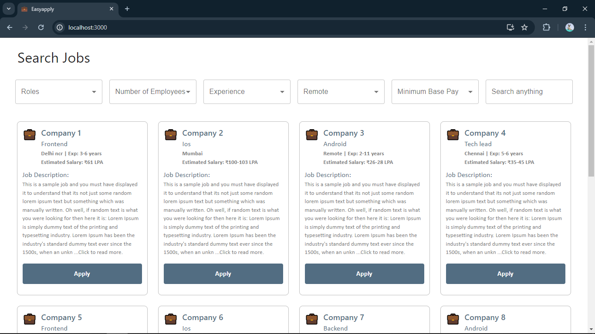
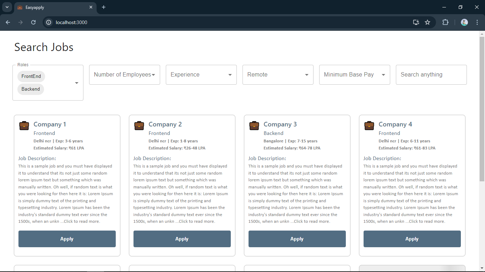
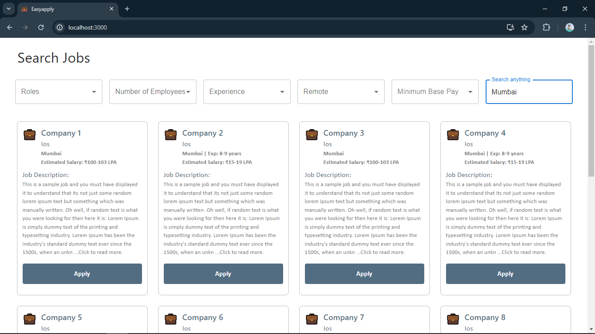

## EasyApply 

A mock job site that lets you search for jobs and apply easily. Based on [WeekDay](https://jobs.weekday.works/). Check comments in App.js to view logic and working explaination. 

### Features

- Infinite scroll
- Responsive design
- Custom search with multiple parameters
- Select options from the search fields to display jobs that match any of the fields.
- You can search for location or role in given search field also
- Clear all search parameters to return back to unfiltered list.

### Tech Stack

- React
- Redux
- Material Ui

### Limitations

The api used here does not provide company name and employee number so for now i have disabled the search feature for those two fields. If searchfield doesn't match any job, it wil keep showing loading screen. App still has some minor bugs which i plan to fix.

### `npm start`

Runs the app in the development mode.\
Open [http://localhost:3000](http://localhost:3000) to view it in your browser.

The page will reload when you make changes.\
You may also see any lint errors in the console.

### Visuals

